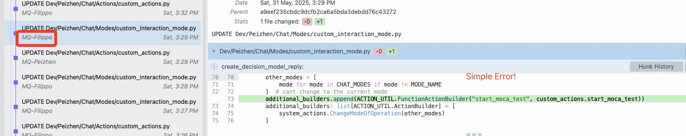
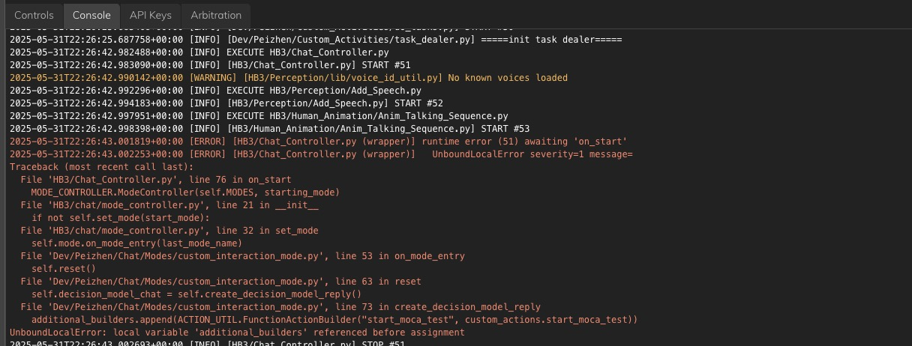
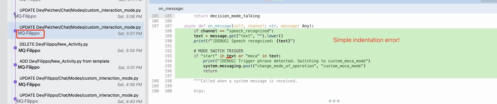
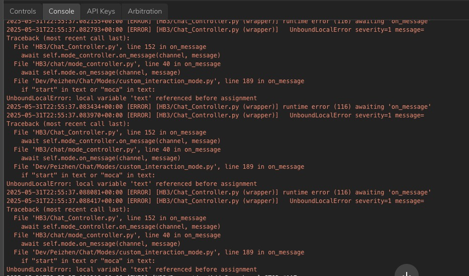

# 🛠️ Hands-on Tutorial for R&D with Tritium OS

## 🔰Basics
1. **Code structure**
    - Developer directories: Dev/Peizhen, Dev/Xu, Dev/Filippo, etc.
    - Avoid modifying scripts outside your own folder.
    - Reuse modules using **relative imports**: ```CONST = system.import_library("../../const.py")```

2. **Entry points** 
    - Key scripts: ```HB3/Chat_Controller.py``` , ```HB3/HB3_Controller.py```.
    - Start/Stop scripts (with ```Activity``` class inside) via buttons or other scripts.
    - Explore and test scripts in the ```/Tests/``` folder to understand functional units and utility functions in the system.

3. **Activity Class Usage**
    - Focus on lifecycle methods: ```on_start```, ```on_stop```, ```on_tick```.
    - **Do not** import scripts that define an ```Activity``` class directly.

4. **Version Control & Auto-Reload**
    - Every "Save" action commits changes to the Git repo and reloads scripts.
    - Review your code carefully before saving—**all team members share the same codebase**.

5. **Tritium OS Architecture**
    - A multiprocess system made of independent nodes.
    - Monitor node performance, especially ```Scripts-Python3``` (⚠️ system may freeze if CPU usage approaches 100%).
    - [Tritium OS Documentation](https://docs.engineeredarts.co.uk/user/tritium-os)


6. **Robot's Dynamic IP Address**
    - Navigate to **System->Hosts->Address**.
    - Required for establishing a connection to the robot.

7. **Facial Expression Interfaces**
    - Key tabs: **Animator**, **Assets**
    - Read the [Animator documentation](https://docs.engineeredarts.co.uk/en/user/tritium_ide_animator) for detailed usage.


8. **Thread Sharing & Async Programming**

    - All activities share a single thread—**don’t block it**.

    - Use ```async/await``` where appropriate.

    - 📖 *Recommended reading:* [Python coroutines](https://realpython.com/async-io-python/).

9. **Event System**
    - Used for communication between script activities.
    - Sending:
        ```
        from time import time
        clock_evt = system.event("talking_clock")
        class Activity:
            @system.tick(fps=0.5)
            def on_tick(self):
                clock_evt.emit(f"The time is now {time()}s since the start of 1970")
        ```
    - Receiving:
        ```
        class Activity:
            @system.on_event("talking_clock")
            def on_clock_talk(self, message):
                print("Got Message: ", repr(message))
        ```

10. **Example: Custom Function Calls**
    - See: ```Scripts/Dev/Peizhen/Chat.py``` for adding your own function calls.


## 🚀 Advanced
11. **High-Level vs. Low-Level Controls**
    - Understand the role of drivers and system controls.

12. **Set Up a Local Server**
    - Enables data exchange with the robot.
    - Currently supported: **text**, **images**
    - Exploratory support: **audio data**


13. **Basic Design Patterns**
    - Includes: ```@decorator```, **consumer/producer**, **singleton**, etc.

14. **Parsing Function/Tool Calls for GPT Models**
    - Learn how to route calls to appropriate functions 

15. **Customizing Facial Expressions Beyond Built-in Options**
    - Fine-grained control
    - Hierarchical structure: device → control → pose → animation

## ✅ Rules for Teamwork Development with Ameca
To ensure smooth collaboration and maintain a clean development environment, please follow these guidelines:

### 🔒 1. Respect Others' Work

 - Do **not** modify other team members’ scripts without explicit permission.

 - Uncoordinated changes, especially those introducing errors, disrupt others’ work and hinder research progress.

 - Example: Overwriting or blocking another member's code wastes valuable time in debugging (See figures below).

### ❌ 2. Leave No Errors Behind
 - Before you finish your session, make sure your code runs error-free.

 - If you are still experimenting or debugging, back up your work locally and remove it from the shared system to avoid cluttering the environment.

 - A shared IDE should be clean and reliable for everyone. Debugging others’ leftover errors is extremely frustrating and time-consuming.

### 🧱 3. Naming Conventions & Project Structure
 - Do not create new folders or scripts outside your own directory. This helps keep the project structure organized.

    - (If you strongly believe changes are necessary, please discuss them with Penny first.)

 - Use consistent naming conventions for:
    - Classes → PascalCase
    - Functions → snake_case
    - Modules → snake_case.py
    - Constants → ALL_CAPS
    - Others → Follow existing conventions in the codebase





